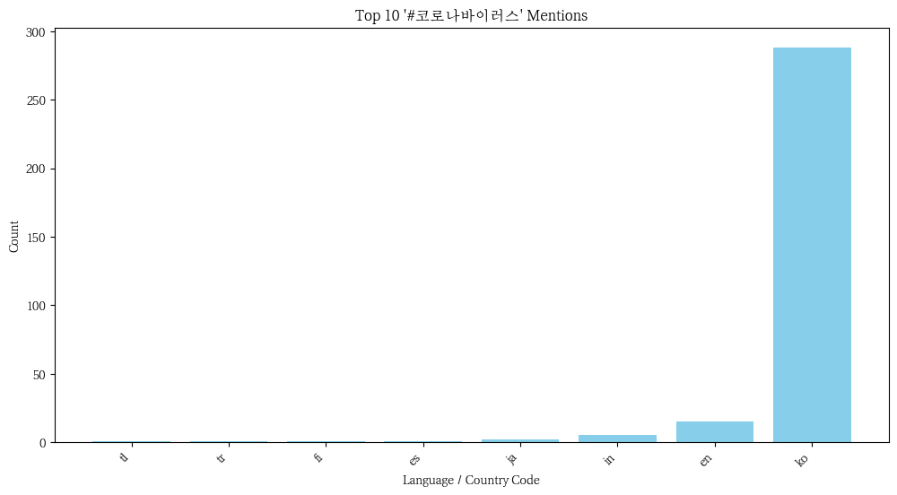
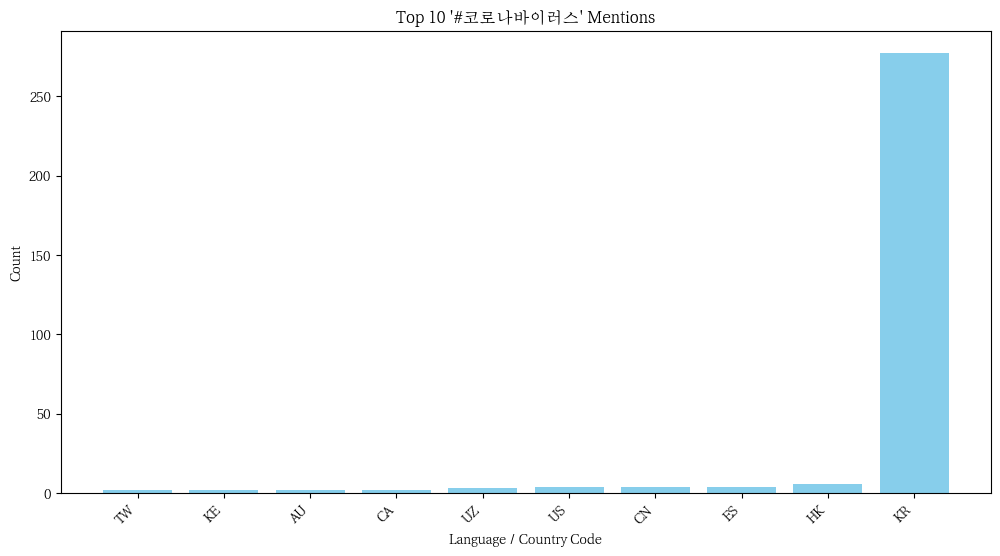

# 🦠 **Twitter Coronavirus Analysis (2020)**

## 📌 **Project Overview**
This project analyzes **geotagged tweets** from 2020 to track the spread of **coronavirus-related discussions** on social media. Using the **MapReduce paradigm**, we process **large-scale multilingual text data** and extract insights at both the **language** and **country** levels. 

### 🔄 **Workflow**
**Map Phase** – Extracts and counts hashtags by **language** and **country** from geotagged tweets.  
**Reduce Phase** – Aggregates hashtag counts across all files.  
**Visualization** – Generates **bar graphs** of top hashtags and a **time-series analysis** of hashtag trends throughout the year.

---

## ⚙️ Technologies Used
- Python (for mapping, reducing, and visualization)
- Bash (for automating the execution of MapReduce tasks)
- JSON (for tweet data processing)
- Matplotlib (for generating visualizations)

---

## 🚀 **How It Works**
### **1️⃣ Mapping Tweets**
- Extracts relevant **hashtags** from geotagged tweets.  
- Counts occurrences by **language** and **country**.  
- Handles missing/inconsistent geolocation data gracefully.

### **2️⃣ Reducing Data**
- Combines hashtag counts from all mapped files.  
- Produces final summary files:  
  - **`final_output.lang`** (Hashtags by language)  
  - **`final_output.country`** (Hashtags by country)  

### **3️⃣ Visualizing Insights**
- 📊 **Bar Graphs** – Top hashtags by language and country  
- 📈 **Time-Series Analysis** – Hashtag usage trends throughout 2020  

---

## 📊 **Key Results**
The following graphs visualize the spread of the coronavirus discussion on Twitter:

### Hashtag Usage by Language
- Example: `#coronavirus` vs. `#코로나바이러스`

### Hashtag Usage by Country
- Example: `#coronavirus` vs. `#코로나바이러스`

### Hashtag Usage Over Time 
- Example: `#coronavirus` vs. `#코로나바이러스`

## How to Run
1. Clone the repository and navigate to the project directory.
2. Execute `run_maps.sh` to process all tweet files.
3. Run `reduce.py` to aggregate the results.
4. Use `visualize.py` to generate bar plots and `alternative_reduce.py` for time-series analysis.
