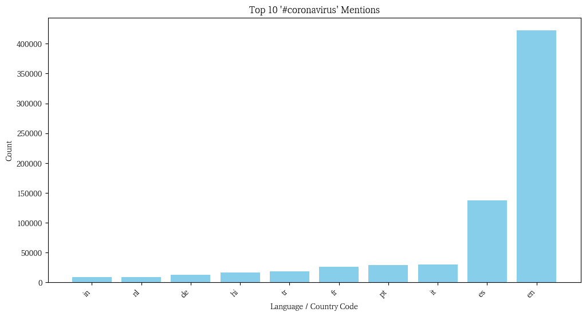
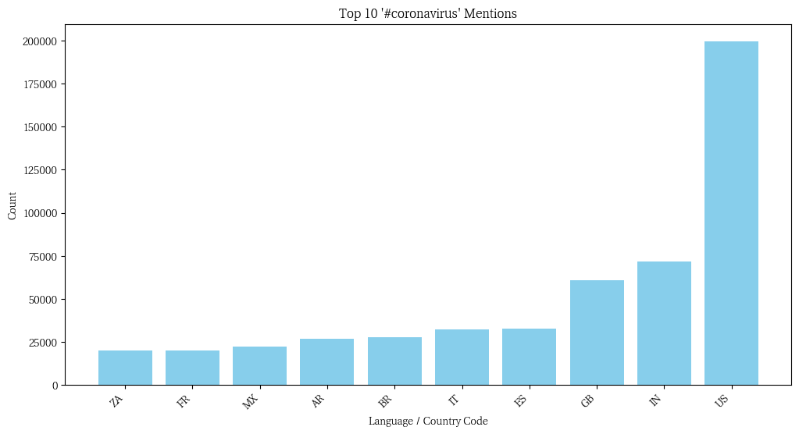
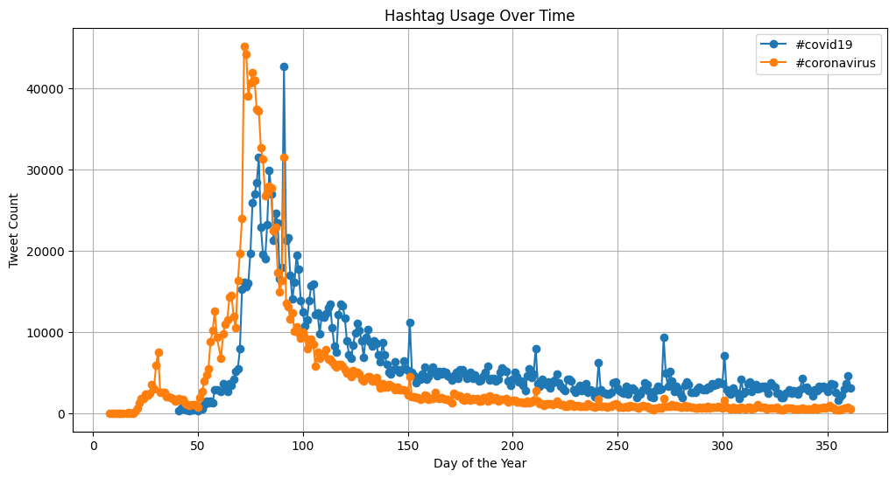

# Monitoring the Spread of Coronavirus on Twitter using MapReduce

## Project Overview
This project analyzes geotagged tweets from 2020 to track the spread of coronavirus-related discussions on social media. Using the MapReduce paradigm, we process large-scale multilingual text data and generate insights at both the language and country levels. The workflow consists of mapping tweets based on hashtags, reducing the data into aggregated statistics, and visualizing key trends.

## Technologies Used
- Python (for mapping, reducing, and visualization)
- Bash (for automating the execution of MapReduce tasks)
- JSON (for tweet data processing)
- Matplotlib (for generating visualizations)

## Workflow
1. **Map Phase**: Extract relevant hashtags from geotagged tweets and count occurrences by language and country.
2. **Reduce Phase**: Aggregate the hashtag counts from the map phase across all files.
3. **Visualization**: Generate bar graphs of top hashtags by language and country, and a time-series analysis of hashtag usage throughout the year.

## Key Results
The following graphs visualize the spread of the coronavirus discussion on Twitter:

### Hashtag Usage by Language

### Hashtag Usage by Country

### Hashtag Usage Over Time 

## How to Run
1. Clone the repository and navigate to the project directory.
2. Execute `run_maps.sh` to process all tweet files.
3. Run `reduce.py` to aggregate the results.
4. Use `visualize.py` to generate bar plots and `alternative_reduce.py` for time-series analysis.
